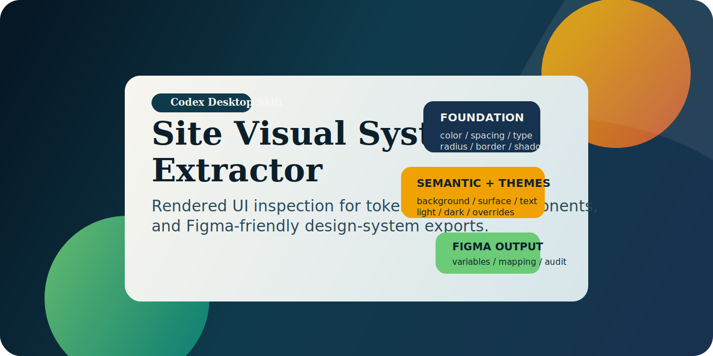

# Codex Site Visual System Extractor

[Русская версия](./README.ru.md) | [English version](./README.en.md)

Production-ready Codex Desktop skill for extracting a reusable visual system from existing websites and web applications.

The skill analyzes rendered UI instead of relying only on source CSS. It inspects hydrated DOM, computed styles, active CSS variables, themes, responsive behavior, and safe component states, then exports Figma-friendly design-system outputs.

## What it does

- Extracts foundation tokens: colors, typography, spacing, sizing, radii, shadows, borders, opacity, motion-related visual values
- Extracts semantic roles: background, surface, text, primary, secondary, accent, success, warning, danger, info, border, overlay, focus ring
- Extracts reusable component patterns and state-level styling
- Exports DTCG-like JSON and Figma-oriented mapping files

## Main outputs

- `tokens.foundation.json`
- `tokens.semantic.json`
- `tokens.components.json`
- `tokens.themes.json`
- `figma-mapping.json`
- `components-summary.md`
- `design-audit.md`

## Quick links

- Skill folder: [site-visual-system-extractor](./site-visual-system-extractor)
- Skill spec: [site-visual-system-extractor/SKILL.md](./site-visual-system-extractor/SKILL.md)
- Standalone bundle README: [site-visual-system-extractor/README.md](./site-visual-system-extractor/README.md)
- Russian documentation: [README.ru.md](./README.ru.md)
- English documentation: [README.en.md](./README.en.md)
